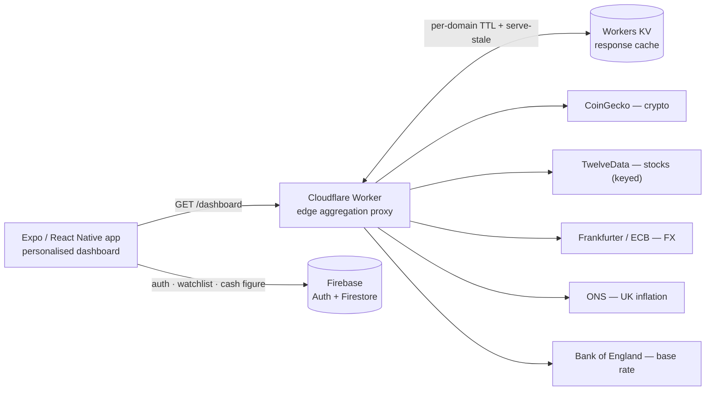

# MoneyMentor — Architecture & Engineering

MoneyMentor began as a React Native financial-literacy coursework app. This
document covers its revival into a portfolio piece: a **personalised, live
financial dashboard** backed by a **Cloudflare Workers edge proxy** that
aggregates several free financial APIs, caches them, and hides API keys.

---

## System overview



The app makes **one request per screen** (`GET /dashboard`) instead of talking to
five upstreams directly. Everything messy — differing payload shapes, rate
limits, API keys, flaky endpoints — is handled at the edge.

---

## The edge proxy (`worker/`)

A single Cloudflare Worker, deployed with `wrangler`, caching in Workers KV.

| Endpoint | Source | Key? | Cache TTL |
| --- | --- | --- | --- |
| `/crypto` | CoinGecko `/coins/markets` | keyless | 60s |
| `/markets` | TwelveData `/quote` | secret | 60s |
| `/fx` | Frankfurter (ECB) | keyless | 12h |
| `/macro/uk` | ONS + Bank of England | keyless | 24h |
| `/dashboard` | all of the above (aggregate) | — | reuses each |
| `/health` | — | — | — |

Design decisions worth calling out:

- **Read-through cache with serve-stale-on-error.** Every fresh entry is mirrored
  to a 7-day "stale" copy. If an upstream fails, the last good value is served
  (`X-Cache: STALE`) rather than erroring the dashboard. (`worker/src/cache.ts`)
- **Partial-failure aggregate.** `/dashboard` fans out with `Promise.allSettled`;
  one dead upstream becomes a `{ source, message }` entry in `errors[]`, not a
  500. The app degrades section-by-section.
- **Per-domain TTLs** matched to how often data actually changes (crypto ticks
  constantly; ECB FX is daily; ONS inflation is monthly).
- **Keys as secrets.** Keyed upstreams read from Worker secrets
  (`wrangler secret put`) — keys never ship in the app bundle or the repo.
- **Deep, testable modules.** Each source takes an injectable `fetcher`, and the
  cache depends on a narrow `KvLike` interface — so the whole proxy is unit-tested
  on plain Vitest without booting `workerd`.

---

## Sourcing real free data (the un-glamorous part)

Every normaliser was written against a **real captured payload**, not guessed
from docs. That discipline repeatedly paid off:

- **ONS.** The official `api.ons.gov.uk` was **decommissioned on 25/11/2024**.
  UK inflation is instead read from the ONS website's JSON (`.../timeseries/{cdid}/{dataset}/data`); values arrive as strings and are coerced.
- **Bank of England.** Only the `_iadb-fromshowcolumns.asp` IADB path returns CSV
  for `csv.x=yes` — the obvious `fromshowcolumns.asp` silently serves an HTML
  page. Date params must keep literal slashes (not `%2F`). The daily series is
  collapsed to its **rate-change points** for a clean step chart.
- **Frankfurter.** `api.frankfurter.dev` is canonical; `.app` now 301-redirects.
- **TwelveData.** Returns a *flat* object for one symbol but an object *keyed by
  symbol* for several, and any symbol can come back as an error entry — the
  normaliser handles all three.
- **CoinGecko** is fully keyless, which let us drop a previously-committed
  CryptoCompare key entirely.

---

## The app

- **Personalised watchlist** (crypto, stocks, FX) stored per-user in Firestore;
  add/remove persists and re-fetches.
- **Shared macro strip** — UK CPI, CPIH, and Bank Rate with sparklines
  (`react-native-gifted-charts`).
- **The "mentor moment":** a card where the user enters a cash figure and sees,
  from the live CPI and Bank Rate, what inflation does to its purchasing power —
  £/year lost, real return vs the base rate, and a 5/10-year projection.
- Typed API client with a hand-built query string (React Native's `URL` is
  unreliable), timeouts, and one error type; loading / error / empty / partial
  states throughout.

Config is a single `EXPO_PUBLIC_WORKER_URL` (Expo inlines it at build).

---

## Testing & CI

- **Worker:** 35 offline tests (normalisation per source, cache HIT/MISS/STALE +
  expiry, router, partial-failure aggregate) grounded in real captured fixtures,
  plus 5 opt-in live tests (`LIVE=1`) that hit the real upstreams — a canary for
  when a free API changes shape.
- **App:** pure-logic tests on the formatters and the extracted UK tax calculator
  (`app/utils/tax.ts`), verified against HMRC worked examples for 2025/26.
- **GitHub Actions:** separate path-scoped workflows for the app and the worker
  (`.github/workflows/`), each running typecheck + tests. Both typecheck cleanly
  from a fresh clone.

---

## Stack

React Native (Expo SDK 52) · TypeScript · Firebase Auth + Firestore ·
Cloudflare Workers + KV · Vitest (worker) · Jest (app) · GitHub Actions.

## Running it locally

```bash
# 1) the edge proxy (no Cloudflare account needed for local dev)
cd worker
cp .dev.vars.example .dev.vars     # optional: add a TwelveData key for stocks
npm install && npm run dev         # http://localhost:8787

# 2) the app
echo "EXPO_PUBLIC_WORKER_URL=http://localhost:8787" > .env
npm install && npm run web         # or: npm run ios
```
