# MoneyMentor

A mobile app that helps adults build financial literacy — a live markets dashboard, budgeting, a UK tax estimator, an interactive glossary, and guided learning modules.

**Engineering deep-dive → [ARCHITECTURE.md](ARCHITECTURE.md)** — the Cloudflare edge API proxy, caching, live-data sourcing, and testing behind the revived app.

---

## Overview

MoneyMentor helps adults improve their financial literacy and money-management skills. It tackles poor financial knowledge with practical tools, educational resources, and interactive features that encourage better budgeting, saving, and decision-making.

**What it brings together**

- **Financial education** — complex terms and concepts simplified into accessible content.
- **Budgeting tools** — track spending, set goals, and manage budgets.
- **Interactive learning** — quizzes, calculators, and charts that make money engaging.
- **Personal guidance** — reminders, tips, and progress tracking.
- **User-centric design** — simple and engaging across all levels of financial knowledge.

## Aim

To improve individuals' ability to manage personal expenditure and increase financial literacy among adults — helping them make informed decisions, build healthier money habits, and reduce financial stress.

## Objectives

- Identify knowledge gaps in financial literacy through questionnaires and research.
- Design a mobile app with accessible, engaging financial-learning tools.
- Incorporate interactive features — goal tracking, calculators, quizzes, and progress visualisations.
- Promote positive financial behaviours with budgeting templates, reminders, and tips.
- Test usability and effectiveness with real users.
- Encourage long-term engagement through appealing, adaptable design.

## Screens

_Captured on iOS (iPhone 16 Pro), with live data served through the edge proxy._

**Auth**

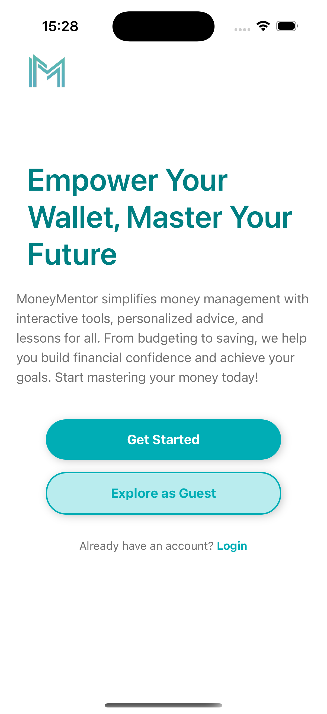
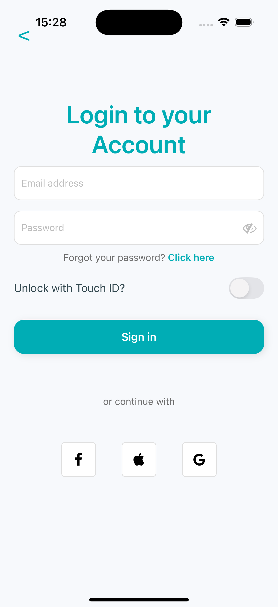
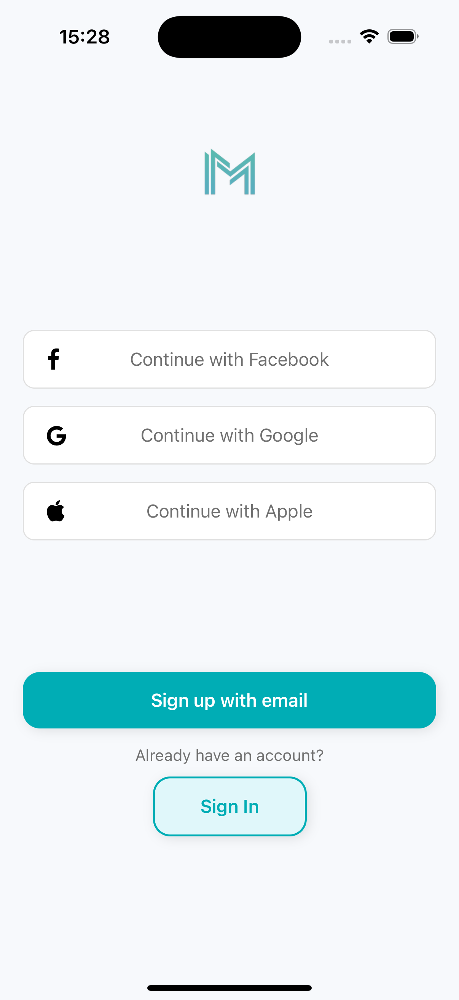

**Dashboard, tools & settings**

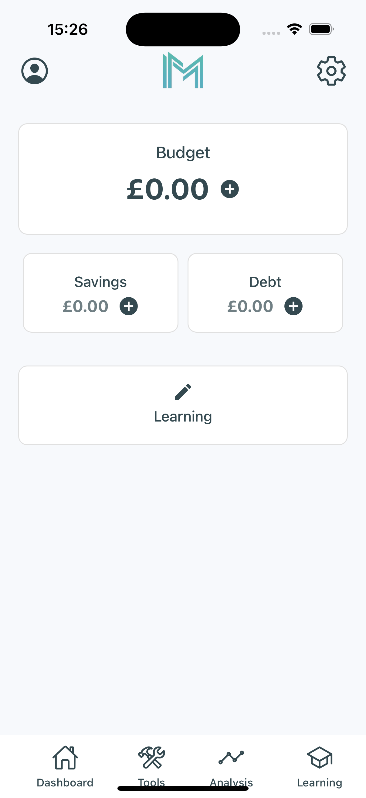
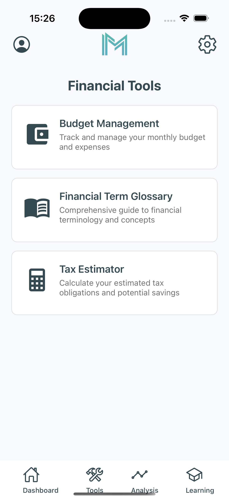
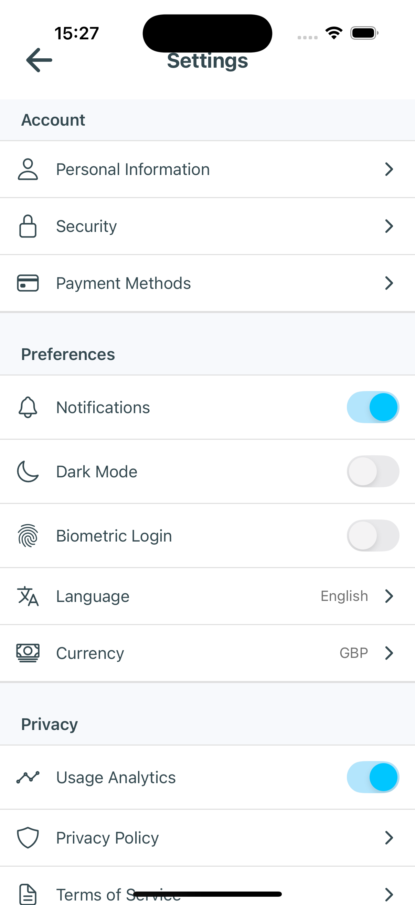

**Markets, tax & budgeting**

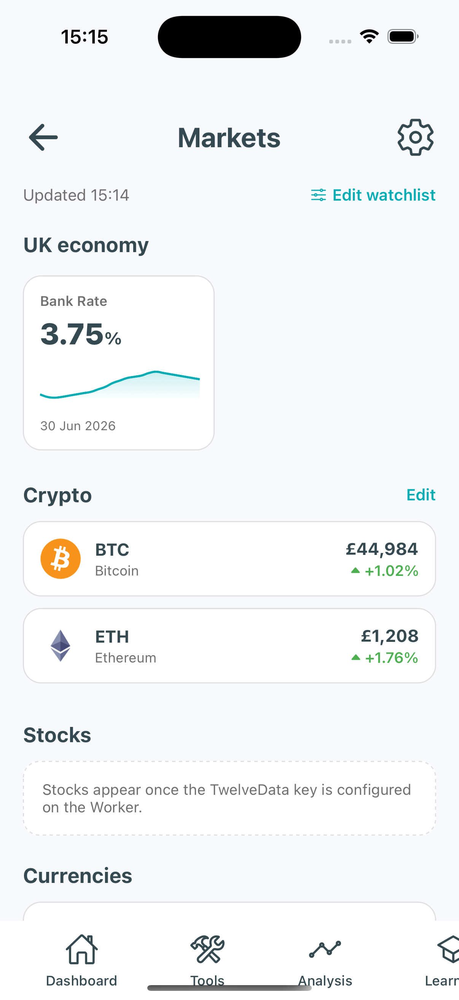
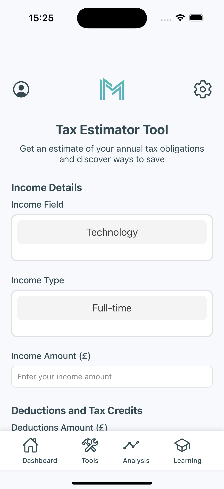
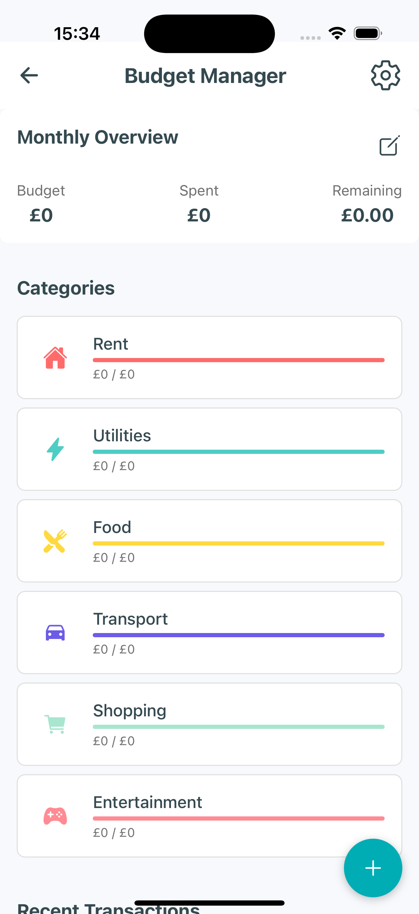

**Learning & glossary**

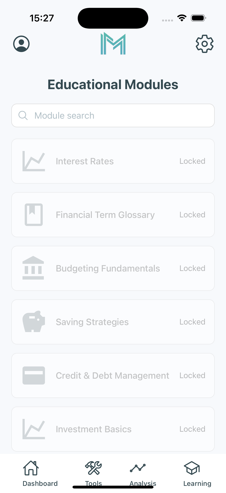
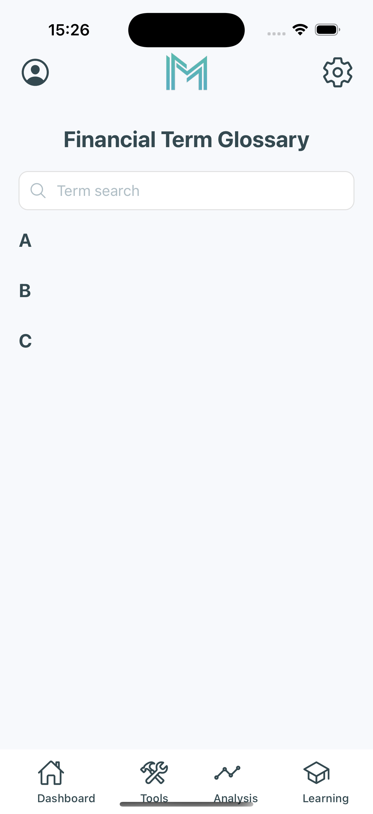

## Design & research

<b>UML, personas, user journeys & prototypes</b> — click to expand

### Use case diagram

### User personas

### User journeys

### Activity diagrams

### Low-fidelity prototypes

### High-fidelity prototypes

## Tech

React Native (Expo SDK 52) · TypeScript · Firebase Auth + Firestore · Cloudflare Workers + KV.

See **[ARCHITECTURE.md](ARCHITECTURE.md)** for the full engineering write-up and how to run it locally.
